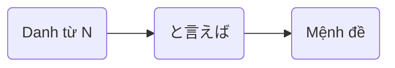

> [!bell]- Dành cho bạn học lần đầu
> Xem trước bài viết [[vi/tags/jpg-notebook|này]] để biết cách sử dụng sổ tay ngữ pháp hiệu quả nhé!

# Cấu trúc ngữ pháp 🔍

Ý nghĩa:
- Nói về N, ~
- Nhắc tới N, ~
- ~ khi nhắc tới N

<h1 style="text-align:center;">「{tên truyện}」</h1>
{audio}

{transcript with translation in message format}

# Cách dùng cơ bản 🗝️

## Đề cập cái gì đó khi nhắc tới N [[#^{backlink to story line}|↑]]

> [!clear]- スミスさんと<ruby>言<rt>い</rt></ruby>えば、<ruby>彼<rt>かれ</rt></ruby>は<ruby>大阪<rt>おおさか</rt></ruby>にいるはずです。
> Nhắc đến anh Smith, hình như anh ấy đang ở Osaka.

> [!clear]- <ruby>日本<rt>にっぽん</rt></ruby>の<ruby>食<rt>た</rt></ruby>べ<ruby>物<rt>もの</rt></ruby>と<ruby>言<rt>い</rt></ruby>えば、やっぱり<ruby>寿司<rt>すし</rt></ruby>が<ruby>一番<rt>いちばん</rt></ruby>ですね。
> Nói về đồ ăn Nhật, thì sushi vẫn là nhất nhỉ.

> [!clear]- <ruby>夏休<rt>なつやす</rt></ruby>みと<ruby>言<rt>い</rt></ruby>えば、<ruby>今年<rt>ことし</rt></ruby>は<ruby>沖縄<rt>おきなわ</rt></ruby>に<ruby>行<rt>い</rt></ruby>きたいなあ。
> Nhắc đến kì nghỉ hè, năm nay tớ muốn đi Okinawa quá.

# Cách dùng nâng cao 🔓

> [!caution]- Nội dung đang hoàn thiện
> Quá trình xây dựng nội dung này có thể mất nhiều thời gian, nhưng bạn có thể thúc đẩy nó bằng cách tham gia [[vi/article-contribution-guide|Hướng dẫn cộng tác bài viết]]
> 
> **Rất mong sự thông cảm của các bạn!**

# Bạn học chú ý 👀

> [!important] Quan trọng
> - {general notices and tip}

> [!info] Ngữ pháp tương tự
> - {grammar}: {short description}

# Tổng kết và giữ chuỗi 🔥
Nếu bạn đọc được đến đây thì xin chúc mừng, chuỗi số {stt} đã thuộc về tay bạn! Bây giờ, hãy cùng mình tóm tắt lại những gì chúng ta đã học được nhé!

{content summary}

Dù sao thì, đừng quên để lại tín hiệu **like, share và comment** nếu thấy truyện hay nhé bạn!
