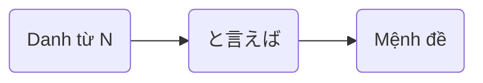

> [!bell]- Dành cho bạn học lần đầu
> Xem trước bài viết [[vi/tags/jpg-notebook|này]] để biết cách sử dụng sổ tay ngữ pháp hiệu quả nhé!

# Cấu trúc ngữ pháp 🔍

**Ý nghĩa**:
- Nói tới N, thì ~  
- Nhắc đến N, thì ~  
- ~ khi nhắc tới N

<h1 style="text-align:center;">「{AI: short story name in japanese}」</h1>
{voice audio in story}

{AI: Use the callout template below to build story content as a multi-person conversation, emphasize sentences using grammar with `[[wikilink]]` to below heading about usage}

> [!clear]- {AI: callout title as `character name: character lines` in japanese}
> {AI: vietnamese version of callout tilte}

# Cách dùng cơ bản 🗝️

## Chuyển chủ đề từ một từ khóa [[#^{backlink to a story line}|↑]]
Ngữ pháp **と言えば** được dùng khi **dựa vào một từ vừa nhắc đến để gợi ra chủ đề mới**.

> [!clear]- スミスさんと<ruby>言<rt>い</rt></ruby>えば、<ruby>彼<rt>かれ</rt></ruby>は<ruby>大阪<rt>おおさか</rt></ruby>にいるはずです。
> Nhắc đến anh Smith, hình như anh ấy đang ở Osaka.

> [!clear]- <ruby>日本<rt>にっぽん</rt></ruby>の<ruby>食<rt>た</rt></ruby>べ<ruby>物<rt>もの</rt></ruby>と<ruby>言<rt>い</rt></ruby>えば、やっぱり<ruby>寿司<rt>すし</rt></ruby>が<ruby>一番<rt>いちばん</rt></ruby>ですね。
> Nói về đồ ăn Nhật, thì sushi vẫn là nhất nhỉ.

> [!clear]- <ruby>夏休<rt>なつやす</rt></ruby>みと<ruby>言<rt>い</rt></ruby>えば、<ruby>今年<rt>ことし</rt></ruby>は<ruby>沖縄<rt>おきなわ</rt></ruby>に<ruby>行<rt>い</rt></ruby>きたいなあ。
> Nhắc đến kì nghỉ hè, thì năm nay tớ muốn đi Okinawa quá.

> [!info] Lưu ý
> - Thường được dùng để dẫn dắt mạch hội thoại sang chủ đề khác nhưng vẫn có liên quan.
> - Không dùng trong văn viết trang trọng như luận văn, báo cáo.

# Cách dùng nâng cao 🔓

> [!caution]- Content in progress
> This content creation process may take time, but you can help it along by participating in the [[vi/article-contribution-guide|Article Contribution Guide]]
>
> **We appreciate your understanding!**

# Bạn học chú ý 👀

> [!important] Quan trọng
> - Dùng khi muốn _gợi mở một chủ đề mới_ dựa trên từ khóa.
> - Không nên nhầm với **といっても** (tuy nói là… nhưng).
> - Giúp hội thoại trở nên tự nhiên và gắn kết hơn.

> [!info] Ngữ pháp tương tự
> - **[[といっても]]**: Dùng để phủ định một phần kỳ vọng. Ví dụ: <ruby>日本語<rt>にほんご</rt></ruby>が<ruby>話<rt>はな</rt></ruby>せるといっても、あいさつだけです。→ Nói là biết tiếng Nhật nhưng chỉ là chào hỏi thôi.
> - **について<ruby>言<rt>い</rt></ruby>えば**: Trang trọng hơn, dùng trong văn viết, có nghĩa "nếu nói về…".

# Tổng kết và giữ chuỗi 🔥
Nếu bạn đọc được đến đây thì xin chúc mừng, **chuỗi số 1** đã thuộc về tay bạn! Bây giờ, hãy cùng mình tóm tắt lại những gì chúng ta đã học được nhé!

- **と<ruby>言<rt>い</rt></ruby>えば** dùng để chuyển chủ đề từ một từ khóa vừa nhắc đến.
- Thường dùng trong hội thoại để gợi mở mạch nói.
- Có nhiều cách nói tương tự, cần phân biệt rõ để tránh nhầm lẫn.

Dù sao thì, đừng quên để lại tín hiệu **like, share và comment** nếu thấy truyện hay nhé bạn!
