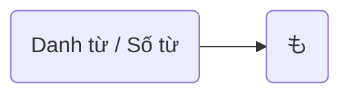

> [!bell]- Dành cho bạn học lần đầu
> Xem trước bài viết [[vi/tags/jpg-notebook|này]] để biết cách sử dụng sổ tay ngữ pháp hiệu quả nhé!

# Cấu trúc ngữ pháp 🔍

**Ý nghĩa**: Cũng / Thậm chí / Tận 

<h1 style="text-align:center;">「{AI: short story name in japanese}」</h1>
{voice audio in story}

{AI: Use the callout template below to build story content as a multi-person conversation, emphasize sentences using grammar with `[[wikilink]]` to below heading about usage}

> [!clear]- {AI: callout title as `character name: character lines` in japanese}
> {AI: vietnamese version of callout tilte}

# Cách dùng cơ bản 🗝️

## Dùng để chỉ sự bổ sung [[#^{backlink to a story line}|↑]]
**も** thường mang nghĩa "cũng", dùng để thêm thông tin vào một đối tượng hoặc hành động đã được đề cập trước đó.

> [!clear]- <ruby>日本語<rt>にほんご</rt></ruby>が<ruby>話<rt>はな</rt></ruby>せます。<ruby>英語<rt>えいご</rt></ruby>**も**<ruby>話<rt>はな</rt></ruby>せます。
> Tôi có thể nói tiếng Nhật. Và **cũng** nói được tiếng Anh.

> [!clear]- <ruby>映画<rt>えいが</rt></ruby>**も**<ruby>見<rt>み</rt></ruby>たいです。
> Tôi **cũng** muốn xem phim.

> [!clear]- コーヒー**も**お<ruby>願い<rt>ねがい</rt></ruby>します。
> Cho tôi **cả** cà phê nữa.

> [!info] Lưu ý
> - Thay thế cho **は** khi muốn nhấn mạnh "cũng"
> - Trong văn nói thường kết hợp với các từ liệt kê.

## Dùng để chỉ số lượng nhiều hơn dự đoán [[#^{backlink to a story line}|↑]]
Khi đi sau số từ, **も** nhấn mạnh sự **vượt ngoài mong đợi**, nghĩa là "tận", "những…".

> [!clear]- <ruby>一<rt>いち</rt></ruby><ruby>日<rt>にち</rt></ruby>で<ruby>本<rt>ほん</rt></ruby>を<ruby>五<rt>ご</rt></ruby><ruby>冊<rt>さつ</rt></ruby>**も**<ruby>読<rt>よ</rt></ruby>みました。
> Tôi đã đọc **tận** 5 cuốn sách trong một ngày.

> [!clear]- <ruby>彼<rt>かれ</rt></ruby>は<ruby>一<rt>いち</rt></ruby><ruby>人<rt>にん</rt></ruby>でピザを<ruby>二<rt>に</rt></ruby><ruby>枚<rt>まい</rt></ruby>**も**<ruby>食<rt>た</rt></ruby>べた。
> Anh ấy đã ăn một mình **tận** hai cái pizza.

> [!clear]- <ruby>先週<rt>せんしゅう</rt></ruby><ruby>三<rt>さん</rt></ruby><ruby>回<rt>かい</rt></ruby>**も**<ruby>映画<rt>えいが</rt></ruby><ruby>館<rt>かん</rt></ruby>に<ruby>行<rt>い</rt></ruby>った。
> Tuần trước tôi đi rạp phim đến **những** 3 lần.

> [!info] Lưu ý
> Diễn tả sự ngạc nhiên về số lượng nhiều, có thể mang nghĩa tích cực hoặc tiêu cực.

## Dùng để nhấn mạnh sự cực đoan hoặc phủ định [[#^{backlink to a story line}|↑]]
**も** cũng được dùng trong câu phủ định để nhấn mạnh sự cực đoan: "đến cả … cũng không".

> [!clear]- <ruby>時間<rt>じかん</rt></ruby>が<ruby>一<rt>いち</rt></ruby><ruby>分<rt>ふん</rt></ruby>**も**なかった。
> Tôi không có nổi một phút.

> [!clear]- <ruby>一円<rt>いちえん</rt></ruby>**も**<ruby>持<rt>も</rt></ruby>っていません。
> Tôi không có nổi một yên nào.

> [!clear]- <ruby>誰<rt>だれ</rt></ruby>**も**<ruby>来<rt>こ</rt></ruby>なかった。
> Không ai đến cả.

> [!info] Lưu ý
> - Trong dạng phủ định, **も** đi kèm với từ chỉ số lượng hoặc đại từ nghi vấn (<ruby>誰<rt>だれ</rt></ruby>, <ruby>何<rt>なに</rt></ruby>, どこ, いつ…)
> - Là cách nói mạnh, thường gặp trong hội thoại.

# Cách dùng nâng cao 🔓

> [!caution]- Content in progress
> This content creation process may take time, but you can help it along by participating in the [[vi/article-contribution-guide|Article Contribution Guide]]
>
> **We appreciate your understanding!**

# Bạn học chú ý 👀
> [!important] Quan trọng
> - **も** là trợ từ đa nghĩa, cần phân biệt theo ngữ cảnh.
> - Khi dùng với số từ → nhấn mạnh sự bất ngờ về số lượng.
> - Khi đi kèm câu phủ định → nghĩa "đến cả … cũng không".

> [!info] Ngữ pháp tương tự
> - **だけ**: Chỉ, nhấn mạnh sự giới hạn (khác với **も** là mở rộng, bổ sung).
> - **さえ**: Nhấn mạnh cực đoan, giống **も** trong phủ định nhưng thường mang nghĩa "ngay cả".
> - **まで**: Thêm thông tin, nhưng thường mang sắc thái "thậm chí".

# Tổng kết và giữ chuỗi 🔥
Nếu bạn đọc được đến đây thì xin chúc mừng, **chuỗi số 2** đã thuộc về tay bạn! Bây giờ, hãy cùng mình tóm tắt lại những gì chúng ta đã học được nhé!

- **も** có ba cách dùng chính:
	1. Bổ sung nghĩa "cũng".
    2. Nhấn mạnh số lượng nhiều hơn dự đoán.
    3. Trong câu phủ định, nhấn mạnh "đến cả … cũng không".
- Đây là một trong những trợ từ **thông dụng và quan trọng** nhất trong tiếng Nhật.

Dù sao thì, đừng quên để lại tín hiệu **like, share và comment** nếu thấy truyện hay nhé bạn!
