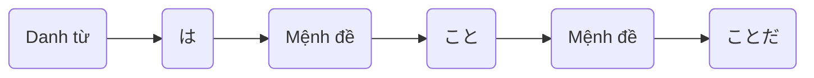

> [!bell]- Dành cho bạn học lần đầu
> Xem trước bài viết [[vi/tags/jpg-notebook|này]] để biết cách sử dụng sổ tay ngữ pháp hiệu quả nhé!

# Cấu trúc ngữ pháp 🔍

**Ý nghĩa**: N là vì ~, ~ (liệt kê một loạt nguyên nhân) 

<h1 style="text-align:center;">「{AI: short story name in japanese}」</h1>
{voice audio in story}

{AI: Use the callout template below to build story content as a multi-person conversation, emphasize sentences using grammar with `[[wikilink]]` to below heading about usage}

> [!clear]- {AI: callout title as `character name: character lines` in japanese}
> {AI: vietnamese version of callout tilte}

# Cách dùng cơ bản 🗝️

{AI: use the template below to present the grammar usages}
## Liệt kê một loạt lý do, nguyên nhân [[#^{backlink to a story line}|↑]]

> [!clear]- 日本語が上達しないのは、勉強不足であること、練習しないことだ。
> Lý do tiếng Nhật không tiến bộ là vì thiếu học tập và vì không luyện tập.

> [!clear]- ダイエットに失敗したのは、運動しなかったこと、食べすぎたことだ。
> Nguyên nhân thất bại trong việc giảm cân là do không tập thể dục và ăn quá nhiều.

> [!clear]- 試験に落ちたのは、準備不足であったこと、緊張しすぎたことだ。
> Lý do trượt kỳ thi là do chuẩn bị không đủ và do quá căng thẳng.
# Cách dùng nâng cao 🔓

> [!caution]- Content in progress
> This content creation process may take time, but you can help it along by participating in the [[vi/article-contribution-guide|Article Contribution Guide]]
>
> **We appreciate your understanding!**

# Bạn học chú ý 👀

> [!important] Quan trọng
> {AI: general notes and tips as bullets}

> [!info] Ngữ pháp tương tự
> {AI: similar grammars with short description and emphasize the difference as bullets}

# Tổng kết và giữ chuỗi 🔥
Nếu bạn đọc được đến đây thì xin chúc mừng, chuỗi số {stt} đã thuộc về tay bạn! Bây giờ, hãy cùng mình tóm tắt lại những gì chúng ta đã học được nhé!

{AI: content summary}

Dù sao thì, đừng quên để lại tín hiệu **like, share và comment** nếu thấy truyện hay nhé bạn!
