> [!bell]- Dành cho bạn học lần đầu
> Xem trước bài viết [[vi/tags/jpg-notebook|này]] để biết cách sử dụng sổ tay ngữ pháp hiệu quả nhé!

# Cấu trúc ngữ pháp 🔍

```mermaid
flowchart LR
    A["Động từ bỏ ます"] --> n1["終わる"] & n2n2["終わらない"] & n3["..."] & n4["終わった"]
    A@{ shape: rounded}
    n1@{ shape: rounded}
    n3@{ shape: rounded}
    n4@{ shape: rounded}
```

**Ý nghĩa**: Hoàn thành một hành động, làm xong một việc gì đó.

<h1 style="text-align:center;">「{AI: short story name in japanese}」</h1>
{voice audio in story}

{AI: Use the callout template below to build story content as a multi-person conversation, emphasize sentences using grammar with `[[wikilink]]` to below heading about usage}

> [!clear]- {AI: callout title as `character name: character lines` in japanese}
> {AI: vietnamese version of callout tilte}

# Cách dùng cơ bản 🗝️

{AI: use the template below to present the grammar usages}
## Biểu thị sự kết thúc của hành động [[#^{backlink to a story line}|↑]]

> [!clear]- 映画を見終わった後で、みんなで感想を話しました。
> Sau khi xem xong bộ phim, mọi người cùng nhau nói cảm tưởng.

> [!clear]- 彼は宿題をやり終わってから、ゲームをしました。
> Cậu ấy chơi game sau khi đã làm xong bài tập.

> [!clear]- 本を読み終わりました
> Tôi đã đọc xong cuốn sách.

# Cách dùng nâng cao 🔓

> [!caution]- Content in progress
> This content creation process may take time, but you can help it along by participating in the [[vi/article-contribution-guide|Article Contribution Guide]]
>
> **We appreciate your understanding!**

# Bạn học chú ý 👀

> [!important] Quan trọng
> {AI: general notes and tips as bullets}

> [!info] Ngữ pháp tương tự
> {AI: similar grammars with short description and emphasize the difference as bullets}

# Tổng kết và giữ chuỗi 🔥
Nếu bạn đọc được đến đây thì xin chúc mừng, chuỗi số {stt} đã thuộc về tay bạn! Bây giờ, hãy cùng mình tóm tắt lại những gì chúng ta đã học được nhé!

{AI: content summary}

Dù sao thì, đừng quên để lại tín hiệu **like, share và comment** nếu thấy truyện hay nhé bạn!
