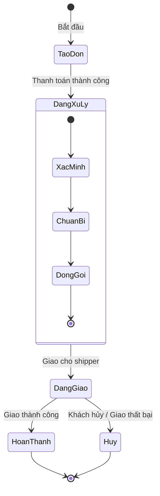

Biểu đồ trạng thái là một trong những biểu đồ quan trọng của UML, được dùng để **mô hình hóa vòng đời (lifecycle) của một đối tượng** trong hệ thống. Nó cho ta thấy:

- Một đối tượng có thể **ở những trạng thái nào** trong suốt vòng đời.
- Những **sự kiện (event)** nào sẽ làm đối tượng chuyển từ trạng thái này sang trạng thái khác.
- Các **hoạt động (action)** xảy ra khi chuyển trạng thái.

👉 Bạn có thể hình dung biểu đồ trạng thái như một "bản đồ hành trình cuộc đời" của một đối tượng.

> [!example] Ví dụ
> - Một đơn hàng online 📦 có thể trải qua các trạng thái: _Được tạo_ → _Đang xử lý_ → _Đang giao_ → _Hoàn thành_ hoặc _Hủy bỏ_.
> - Những sự kiện như _Khách hàng xác nhận_, _Hệ thống duyệt thanh toán_, _Shipper giao thành công_ chính là các **event** dẫn đến thay đổi trạng thái.

## Khái niệm cơ sở cho biểu đồ trạng thái 🌀

Biểu đồ trạng thái được xây dựng dựa trên khái niệm **máy trạng thái hữu hạn (Finite State Machine - FSM)[^1]**. Trong đó:

### Sự kiện (Event)

Sự kiện là **tác nhân kích hoạt** làm cho một đối tượng thay đổi trạng thái. Một sự kiện có thể được kích hoạt bởi: người dùng, hệ thống, hoặc một điều kiện nội bộ. Các loại sự kiện thường gặp:

- **Signal Event (Tín hiệu):** Một tín hiệu gửi từ đối tượng này sang đối tượng khác, ví dụ: _máy chủ gửi tín hiệu timeout cho client_.
- **Call Event:** Một lời gọi đến phương thức của đối tượng, ví dụ: _gọi hàm `rutTien()` trên ATM_.
- **Time Event:** Sự kiện dựa trên thời gian, ví dụ: _sau 30 giây không thao tác thì ATM tự thoát_.
- **Change Event:** Khi một điều kiện logic trở thành đúng, ví dụ: _nhiệt độ > 100°C thì nồi cơm chuyển sang trạng thái tắt_.

### Tín hiệu (Signal)

Tín hiệu là một **dạng thông điệp không đồng bộ**[^2] được gửi từ một đối tượng này đến đối tượng khác.
- Nó mang thông tin sự kiện.
- Ví dụ: _Cảm biến cửa gửi tín hiệu "DoorOpened" đến hệ thống báo động_.

### Trạng thái (State)

Trạng thái là một **tình huống ổn định** trong vòng đời của một đối tượng, tại đó đối tượng thỏa mãn một số điều kiện, thực hiện một hoạt động hoặc chờ đợi một sự kiện. Có thể mô tả theo 3 cách:

1. **Trạng thái như một điều kiện (condition):** Ví dụ _Đèn = Bật_.
2. **Trạng thái như một hoạt động đang diễn ra (activity):** Ví dụ _Đèn = Đang chiếu sáng_.
3. **Trạng thái như một tình huống chờ (waiting situation):** Ví dụ _ATM = Chờ người dùng nhập PIN_.

> [!info] Lưu ý
> Tất cả các đối tượng cùng một trạng thái sẽ phản ứng theo cùng một cách đối với một sự kiện
> 

### Trạng thái phức hợp (Composite State)

Là trạng thái được **phân rã thành các trạng thái con** bên trong.
- Cho phép mô hình hóa hành vi phức tạp, giúp sơ đồ gọn hơn.
- Ví dụ: Trạng thái _Đang xử lý đơn hàng_ có thể chia nhỏ thành: _Xác minh thanh toán_ → _Chuẩn bị hàng_ → _Đóng gói_.

### Chuyển (Transition)
👉 Chuyển là **sự di chuyển từ một trạng thái sang trạng thái khác** khi sự kiện xảy ra.
- Được biểu diễn bằng một mũi tên.
- Có thể kèm theo điều kiện (guard) và hành động (action).

**Chuyển bên trong (Internal Transition):**
- Là loại chuyển được **xử lý ngay trong trạng thái hiện tại**, không làm thay đổi sang trạng thái khác.
- Ví dụ: Trong trạng thái _Đang gọi điện_, sự kiện _tăng âm lượng_ chỉ thay đổi thông số nhưng vẫn giữ trạng thái _Đang gọi điện_.

%% ![[Pasted image 20250919143544.png]] %%

> [!check] Điểm mạnh của biểu đồ trạng thái
> - Mô tả trực quan vòng đời đối tượng
> - Giúp phát hiện những tình huống chưa lường trước (ví dụ trạng thái bị bỏ sót)
> - Hữu ích cho cả **phân tích yêu cầu** và **thiết kế chi tiết**.

## Mô hình hóa biểu đồ trạng thái 🔄

Khi mô hình hóa bằng UML, ta sử dụng các ký hiệu chuẩn:
- **Nút đen đặc**: Trạng thái bắt đầu.
- **Hình tròn kép**: Trạng thái kết thúc.
- **Hình chữ nhật bo tròn**: Biểu diễn trạng thái.
- **Mũi tên**: Biểu diễn chuyển trạng thái.
- **Sự kiện/điều kiện** ghi trên đường chuyển: `event [guard] / action`.

Quy trình xây dựng biểu đồ trạng thái:
1. **Xác định đối tượng** cần mô hình hóa vòng đời.
2. **Liệt kê các trạng thái chính** mà đối tượng có thể có.
3. **Xác định các sự kiện** có thể xảy ra.
4. **Vẽ các chuyển trạng thái** tương ứng, gắn sự kiện và điều kiện.
5. **Đặt hoạt động (action)** nếu cần trên các cạnh hoặc trong trạng thái.

Ví dụ: UML cho đối tượng _Đơn hàng_

👉 Nhìn vào biểu đồ, ta thấy ngay toàn bộ vòng đời của đơn hàng từ lúc được tạo đến khi hoàn tất/hủy.

## Tóm lại 🤌

- **Biểu đồ trạng thái** = "bản đồ vòng đời đối tượng".
- Nó giúp ta quản lý các trạng thái và sự kiện trong hệ thống, đảm bảo không bỏ sót kịch bản.
- UML cung cấp ký pháp rõ ràng, dễ dùng, phục vụ tốt cho cả phân tích và thiết kế.

[^1]: Một máy trạng thái mô tả **các trạng thái khác nhau của một đối tượng** và **cách nó phản ứng khi có sự kiện xảy ra**. Mỗi sự kiện có thể tạo ra hiệu ứng (hành động) và dẫn đến việc **chuyển sang trạng thái mới**, qua đó biểu diễn hành vi động của **lớp, ca sử dụng hay phương thức** trong hệ thống.

[^2]: Thông điệp **không đồng bộ** là loại thông điệp mà **người gửi không chờ phản hồi ngay lập tức từ người nhận**. Người gửi chỉ cần phát đi tín hiệu, rồi tiếp tục công việc khác; người nhận sẽ xử lý khi nhận được.