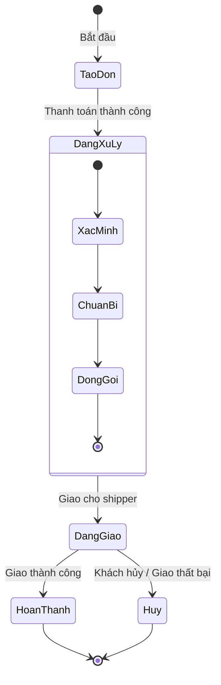

## Tổng quan 🔭

**Biểu đồ trạng thái** là một trong những biểu đồ quan trọng của UML, được dùng để mô tả hành vi động của các đối tượng theo thời gian bằng cách mô hình hóa **vòng đời** của chúng trong hệ thống. Nó cho ta thấy:

- Một đối tượng có thể **ở những trạng thái nào** trong suốt vòng đời.
- Những **sự kiện** nào sẽ làm đối tượng chuyển từ trạng thái này sang trạng thái khác.
- Các **hoạt động** xảy ra khi chuyển trạng thái.

👉 Bạn có thể hình dung biểu đồ trạng thái giống như cuốn album chụp hình bạn từ lúc bé đến lớn, mỗi tấm ảnh tương ứng với một **trạng thái** của bạn tại thời điểm đó và những ghi chép trên album chính là các **sự kiện và hoạt động** đã diễn ra trong hành trình khôn lớn của bạn. 

## Bên trong biểu đồ trạng thái 🔬

### Sự kiện

Sự kiện là **tác nhân kích hoạt** việc thay đổi trạng thái của một đối tượng. Bản thân nó cũng được kích hoạt bởi đa dạng yếu tố như người dùng, hệ thống, hay một điều kiện nội bộ nào đó, ... Nên cũng đa dạng thể loại sự kiện được sinh ra từ đó, cụ thể: 

- **Sự kiện tín hiệu**: dựa trên tín hiệu được gửi từ đối tượng này sang đối tượng khác, *ví dụ*: máy chủ gửi tín hiệu `timeout` cho máy khách, máy khách chuyển sang trạng thái "lỗi/thử lại"
- **Sự kiện gọi**: dựa trên lời gọi hàm/phương thức của đối tượng, *ví dụ*: gọi hàm `withdraw()` trên đối tượng ATM sẽ khiến đối tượng này chuyển sang trạng thái "đang rút tiền"
- **Sự kiện thời gian**: dựa trên các điều kiện về thời gian để kích hoạt thay đổi trạng thái, *ví dụ*: sau 30 giây không thao tác thì ATM tự thoát (chuyển về trạng thái "đã thoát").
- **Sự kiện thay đổi**: dựa trên sự thay đổi logic đúng ↔ sai mà chuyển trạng thái, *ví dụ*: nhiệt độ > 100°C thì nồi cơm chuyển sang trạng thái tắt.

### Tín hiệu

Tín hiệu là phương tiện giao tiếp giữa đối tượng gửi và đối tượng nhận, nó mang thông tin sự kiện được tạo ra bởi đối tượng gửi để đối tượng tiếp nhận thông tin đó thực hiện các hành động tương ứng (chuyển trạng thái, tính toán, phản hồi, ...)

> [!example]- Ví dụ
> Cảm biến nhiệt độ gửi tín hiệu "hot" (thông tin từ sự kiện cháy) đến thiết bị báo cháy để kích hoạt hệ thống dập lửa.

### Trạng thái

Trạng thái là một **tình huống ổn định** trong vòng đời của một đối tượng, tại đó đối tượng thỏa mãn một số điều kiện, thực hiện một hoạt động hoặc chờ đợi một sự kiện. Có thể mô tả theo 3 cách:

1. **Trạng thái như một điều kiện (condition):** Ví dụ _Đèn = Bật_.
2. **Trạng thái như một hoạt động đang diễn ra (activity):** Ví dụ _Đèn = Đang chiếu sáng_.
3. **Trạng thái như một tình huống chờ (waiting situation):** Ví dụ _ATM = Chờ người dùng nhập PIN_.

> [!info] Lưu ý
> Tất cả các đối tượng cùng một trạng thái sẽ phản ứng theo cùng một cách đối với một sự kiện
> 

### Trạng thái phức hợp (Composite State)

Là trạng thái được **phân rã thành các trạng thái con** bên trong.
- Cho phép mô hình hóa hành vi phức tạp, giúp sơ đồ gọn hơn.
- Ví dụ: Trạng thái _Đang xử lý đơn hàng_ có thể chia nhỏ thành: _Xác minh thanh toán_ → _Chuẩn bị hàng_ → _Đóng gói_.

### Chuyển
👉 Chuyển là **sự di chuyển từ một trạng thái sang trạng thái khác** khi sự kiện xảy ra.
- Được biểu diễn bằng một mũi tên.
- Có thể kèm theo điều kiện (guard) và hành động (action).

**Chuyển bên trong (Internal Transition):**
- Là loại chuyển được **xử lý ngay trong trạng thái hiện tại**, không làm thay đổi sang trạng thái khác.
- Ví dụ: Trong trạng thái _Đang gọi điện_, sự kiện _tăng âm lượng_ chỉ thay đổi thông số nhưng vẫn giữ trạng thái _Đang gọi điện_.

%% ![[Pasted image 20250919143544.png]] %%

> [!check] Điểm mạnh của biểu đồ trạng thái
> - Mô tả trực quan vòng đời đối tượng
> - Giúp phát hiện những tình huống chưa lường trước (ví dụ trạng thái bị bỏ sót)
> - Hữu ích cho cả **phân tích yêu cầu** và **thiết kế chi tiết**.

### Máy trạng thái
Máy trạng thái là một đồ thị gồm các **trạng thái** và các **chuyển** nối chúng lại với nhau, nó có thể phản ánh **một phần hoặc toàn bộ** biểu đồ trạng thái vì chức năng của máy trạng thái chính là **mô hình hóa lịch sử vòng đời** có thể có của các đối tượng trong hệ thống. Những đối tượng này có thể thuộc về một lớp, hành vi, ca sử dụng hay cộng tác ... 

Khi đối tượng phát hiện một sự kiện từ bên ngoài, tùy theo trạng thái hiện thời mà nó phản hồi theo các cách khác nhau. Phản hồi ở đây bao gồm cả việc thực thi gây ra các thay đổi trong ngoài đối tượng trước khi chuyển sang trạng thái mới.

## Mục đích của biểu đồ trạng thái 🔄

Khi mô hình hóa bằng UML, ta sử dụng các ký hiệu chuẩn:
- **Nút đen đặc**: Trạng thái bắt đầu.
- **Hình tròn kép**: Trạng thái kết thúc.
- **Hình chữ nhật bo tròn**: Biểu diễn trạng thái.
- **Mũi tên**: Biểu diễn chuyển trạng thái.
- **Sự kiện/điều kiện** ghi trên đường chuyển: `event [guard] / action`.

Quy trình xây dựng biểu đồ trạng thái:
1. **Xác định đối tượng** cần mô hình hóa vòng đời.
2. **Liệt kê các trạng thái chính** mà đối tượng có thể có.
3. **Xác định các sự kiện** có thể xảy ra.
4. **Vẽ các chuyển trạng thái** tương ứng, gắn sự kiện và điều kiện.
5. **Đặt hoạt động (action)** nếu cần trên các cạnh hoặc trong trạng thái.

Ví dụ: UML cho đối tượng _Đơn hàng_

👉 Nhìn vào biểu đồ, ta thấy ngay toàn bộ vòng đời của đơn hàng từ lúc được tạo đến khi hoàn tất/hủy.

## Tóm lại🎬

- **Biểu đồ trạng thái** = "bản đồ vòng đời đối tượng".
- Nó giúp ta quản lý các trạng thái và sự kiện trong hệ thống, đảm bảo không bỏ sót kịch bản.
- UML cung cấp ký pháp rõ ràng, dễ dùng, phục vụ tốt cho cả phân tích và thiết kế.

[^1]: Một máy trạng thái mô tả **các trạng thái khác nhau của một đối tượng** và **cách nó phản ứng khi có sự kiện xảy ra**. Mỗi sự kiện có thể tạo ra hiệu ứng (hành động) và dẫn đến việc **chuyển sang trạng thái mới**, qua đó biểu diễn hành vi động của **lớp, ca sử dụng hay phương thức** trong hệ thống.

[^2]: Thông điệp **không đồng bộ** là loại thông điệp mà **người gửi không chờ phản hồi ngay lập tức từ người nhận**. Người gửi chỉ cần phát đi tín hiệu, rồi tiếp tục công việc khác; người nhận sẽ xử lý khi nhận được.